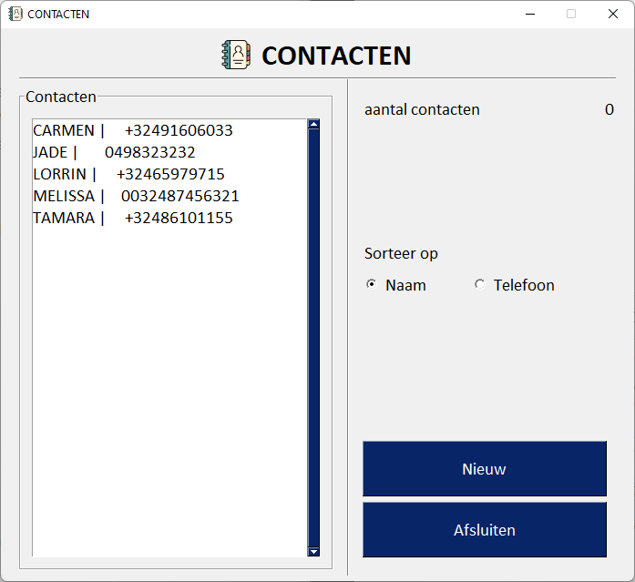
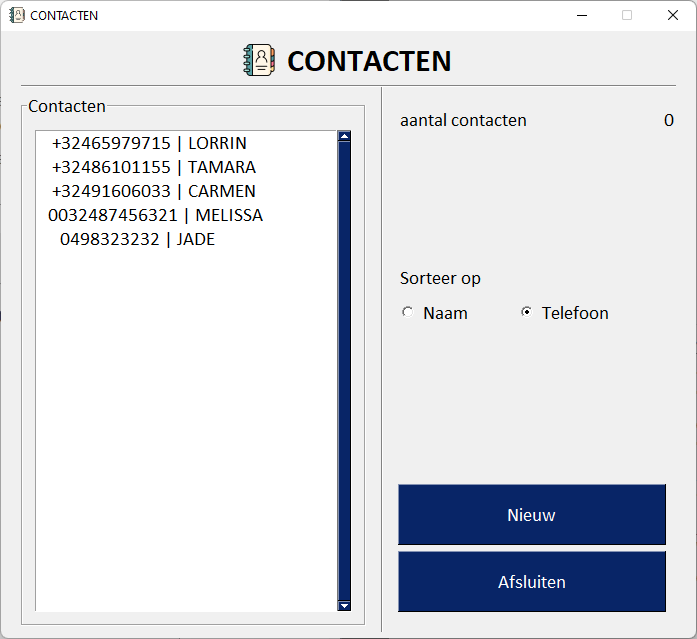
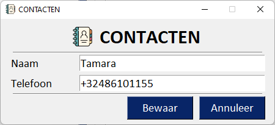
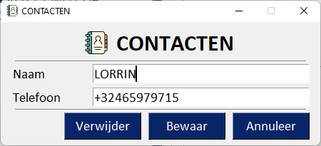
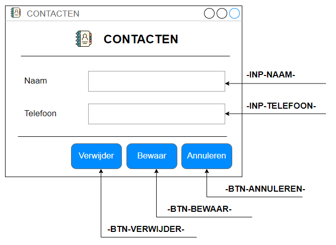

# Oefening 06

JSON (JavaScript Object Notation) is een populair bestandsformaat dat niet alleen gebruikt wordt voor het uitwisselen van gegevens, maar ook voor het bewaren van gegevens.

We maken in deze opdracht van het JSON bestandsformaat gebruik om gegevens voor een volgende sessie te bewaren.

## Opdracht

Je maakt een kleine applicatie met grafische gebruikersinterface waarmee je contacten beheert.  Van elk contact wordt de naam en het telefoonnummer verzameld.

Bij het starten van de applicatie wordt het JSON-bestand met de gegevens van de contacten ingelezen en in de Listbox weergegeven.  



Met Radiobuttons worden de contacten in de lijst op naam of op telefoonnummer gesorteerd.



Met de knop 'Nieuw' kan je een nieuw contact aanmaken



door op een contact in de Listbox te klikken, kan je de gegevens van dit contact bewerken of kan je er de voorkeur aan geven om het contact te verwijderen.



## Structuur van het project

De structuur van het project staat hieronder afgebeeld.

```textile
│   main.py
│
├───app
│       app.py
│       app_layout.py
│       dlgcontact.py
│       dlgcontact_layout.py
│       init_layout.py
│
├───assets
│       favicon.ico
│       logo.png
│
├───bin
├───data
└───entiteit
        contact.py
        contactlijst.py
```

Nieuw in dit project is het bestand `init_layout.py` waarmee de globale instellingen van de grafische gebruikersinterface gezet worden.

Verder is ook de map 'data' nieuw.  Aan deze map kennen we het JSON-bestand toe met de contacten.

## Grafische gebruikersinterface

In deze applicatie maken we gebruik van twee vensters, we onderscheiden het '**hoofdvenster**' en een **detailvenster**.  

### Globale GUI intellingen, variabelen en functies

Onze applicatie bestaat uit meerderevensters,  Sommige elementen en instellingen zijn van toepassing op beide vensters, denk maak aan de icon in de titelbalk van het venster, of de kop met logo en titel, of het lettertype dat je op elementen toepast.

Deze gemeenschappelijke elementen en kennen we toe aan het bestand `init_layout.py`.

Omdat het instellingen van de grafische gebruikersinterface betreft, ligt het voor de hand dat je de module 'FreeSimpleGUI' importeert.

```python
import FreeSimpleGUI as sg
```

We starten met het declareren van variabelen voor de tekstopmaak.  Aan 'fntStandaard' kennen we de opmaak van het lettertype toe dat - op een uitzondering na - op alle elementen in de applicatie toegepast wordt.  We maken gebruik van het lettertype 'Calibri', grootte 14.

Voor de kop van het venster, declareren we de variabele 'fntKop', ook met 'Calibri' als lettertype, maar deze keer met grootte 24 en stijl vel (bold).

```python
fntStandaard = ('Calibri', 14)
fntKop = ('Calibri', 24, 'bold')
```

Voor deze kleine applicatie gebruiken we in beide vensters dezelfde titel in de titelbalk, namelijk 'CONTACTEN'.  Ook dit kennen we toe aan een variabele, namelijk de variabele 'vensterTitel'.

```python
vensterTitel = 'CONTACTEN'
```

Aan de functie `vensterKop()` kennen we de opmaak de layout toe voor de kop van het venster, met logo en titel.  Op deze manier hoef je in de layout enkel deze functie aan te roepen.

```python
def vensterKop():
    return [
        sg.Push(),
        sg.Image(
            source = 'assets/logo.png'
        ),
        sg.Text(
            text = 'CONTACTEN',
            font = fntKop
        ),
        sg.Push()
    ]
```

In de vensters maken we meerdere keren gebruik van een 'HorizontalSeperator()' waaraan we telkens dezelfde opmaak toekennen.  Om niet steeds in herhaling te vallen, declareren we de functie `horizontaal()` die de layout geeft voor deze rij in de applicatie.

```python
def horizontaal():
    return [
        sg.HorizontalSeparator(
            pad = (10, 0)
        )
    ]
```

Ten slotte leggen we het globale thema van de vensters vast

```python
sg.theme('DefaultNoMoreNagging')
```

Met de methode `set_options()`  eigen aan 'FreeSimpleGUI' zet je kenmerken die van toepassing zijn op alle vensters in de applicatie: de favicon en het standaard lettertype dat op alle elementen van toepassing is.

```python
sg.set_options(
    icon = 'assets/favicon.ico',
    font = fntStandaard
)
```

### Hoofdvenster

Omdat we de inhoud van de listbox met code updaten, moeten we bij in instantiëren van de klasse 'Window' de parameter 'finalize = True' meegeven.

Zo kunnen we bij het starten van de applicatie het JSON gegevensbestand uitlezen en weergeven in de listbox of wanneer we de sorteermethode wijzigen.

De inhoud van het hoofdvenster bestaat uit twee kolommen en realiseren we met een `Comlumn()`-element.

**Kolom links**

Aan  de layout van de linker kolom wordt een `Frame()`-element toegekend met titel 'Contacten' en aan de layout kennen we een `Listbox()`-element toe met volgende kenmerken:

aan het verplichte attribuut 'values' ken je voorlopig een lege list toe.  Bij het opstarten van de applicatie injecteren we deze eigenschap met de reeds eerder opgeslagen contacten.

ken aan deze frame als grootte 30x20 toe met horizontale en verticale padding 12.

om ervoor te zorgen dat je slechts één contact tegelijk uit de listbox kunt selecteren, ken je aan de eigenschap 'select_mode' de constante 'LISTBOX_SELECT_MODE_SINGLE' toe

om de inhoud van de listbox up te daten of om te achterhalen of de gebruiker op een item in de listbox klikt ken je aan de eigenschap 'key' de waarde '-LBX-CONTACTEN-' toe.

maak gebruik van 'enable_events' om ervoor te zorgen dat een 'event' getriggered wordt wanneer de gebruiker op een item in de lijst klikt, 

**Kolom rechts**

In de layout van deze kolom onderscheiden we volgende elementen:

* 1ste blok:
  
  * 'Aantal contacten':   
    `Text()`-element met grootte 18x1
  
  * '0' het aantal:   
    `Text()`-element, grootte 8x1, rechts uitgelijnd, 'key' '-TXT-AANTAL-'

* 2de blok:
  
  * 'Sorteren op':  
    `Text()`-element
  
  * 'Naam', 'Telefoon'  
    `Radio()`-element, koppel beide radiobuttons aan elkaar met een 'group_id'.  Beide elementen meten 8x1.  Zet de eerste radiobutton standaard geselecteerd.  Met 'enable_events' zorg je ervoor dat een event getriggered wordt.  Ken aan de radiobutton 'Naam' de key '-RBN-NAAM' toe, terwijl dat je aan radiobutton 'Telefoon' de key '-RBN-TELEFOON-' toekent.

* 3de blok:  
  
  * 'Nieuw', 'Afsluiten':  
    `Button`-elementen met grootte 26x2.  Ken aan de knoppen de key '-BTN-NIEUW-', respectievelijk '-BTN-AFSLUITEN-' toe.

* Voor de verticale ruimte tussen de blokken maak je gebruik van een `HorizontalSeparator`-element met padding 0x70


Net voordat de while-lus doorlopen wordt, wordt de inhoud van de listbox '-LBX-CONTACTEN-' gezet door van de klasse 'ContactLijst' de methode `lijst()` aan te roepen.

Op analoge wijze zetten we de inhoud van het Text-element '-TXT-AANTAL-' door van de klasse 'ContactLijst' de eigenschap `aantal` op te halen en toe te kennen.

```python
venster['-LBX-CONTACTEN-'].update(values = self._contactLijst.lijst())
venster['-TXT-AANTAL-'].update(str(self._contactLijst.aantal))
```

### Detailvenster

Wanneer het detailvenster geopend is, moeten we verhinderen dat de gebruiker dit venster kan negeren en verder werken in het hoofdvenster.  Om dit voor elkaar te krijgen maken we gebruik van een zogenaamde 'modal window' of 'modaal venster' en dit kan je bewerkstelligen door bij het declareren van het Window-object (instantie van de klasse Window) de parameter 'modal = True' mee te geven.

Verder manipuleren we met code - naargelang het een nieuw contact of een contact betreft die we bewerken - de knop 'Verwijder' en de inhoud van de tekstvelden.  Om dit mogelijk te maken moeten we bij het instantiëren van de klasse Window de parameter 'finalize = True' meegeven.

Voor het formulier, labels en tekstvelden maak je gebruik van `Text()`- en `Input()`-elementen.  Aan de label-elementen ken je een grootte van 10x1 toe, terwijl je aan de tekstvelden een grootte van 30x1 toekent  Ken aan de tekstvelden de 'key' '-INP-NAAM-' en '-INP-TELEFOON-' toe.

Aan de knoppen ken je een grootte van 10x1 toe.  Ken aan de knoppen de respectievelijke 'key'-waarden '-BTN-VERWIJDER-', '-BTN-BEWAAR' en '-BTN-ANNULEER-' toe.



Verberg met code de knop met opschrift 'Verwijder' als er een nieuw contact wordt aangemaakt.  Ook met code vul je de tekstvelden met de corresponderende waarde wanneer een contact wordt bewerkt.

Voordat de while-lus van dit venster doorlopen wordt zetten we de tekstvelden '-INP-NAAM-' en '-INP-TELEFOON-'.

Bewerken we een bestaand object, dan zetten we de knop 'Verwijder' zichtbaar, bij een nieuw contact wordt deze knop verborgen.

```python
venster['-INP-NAAM-'].update(oContact.naam)
venster['-INP-TELEFOON-'].update(oContact.telefoon)
venster['-BTN-VERWIJDER-'].update(visible  = True if mode == 'BEWERK' else False)

```

## Entiteitklassen

Een entiteitklasse representeert een betekenisvolle eenheid die zowel van een reële of abstracte aard kan zijn.

De instanties van een entiteitklasse, de objecten, zijn verantwoordelijke voor de integriteit van het object, met andere woorden ze kijken erop toe of de inhoud van de eigenschappen correct zijn.  

**Contact**

Zo is de entiteitklasse 'Contact' verantwoordelijk voor de inhoud van de eigenschappen 'naam' en 'telefoon'.  De klasse moet de inhoud voor de variabele valideren.

De klasse `Contact`

* eigenschappen:
  
  * `_sorteerMode`  
    bepaalt op welke eigenschap twee contacten gesorteerd worden
  
  * `_naam`  
    naam van de contact
  
  * `_telefoon`  
    telefoonnummer contact

* methoden:
  
  * ` __init__(self, naam:str, telefoon:str, sorteerMode:str)`  
    constructor met parameters `naam`, `telefoon` en `sorteerMode`
  
  * `naam(self)`  
    getter, levert de inhoud van de eigenschap `_naam`
  
  * `naam(self, naam: str)`  
    setter, hiermee zet je na validatie de eigenschap `_naam`
  
  * `telefoon(self)`  
    getter, levert de inhoud van de eigenschap `_telefoon`
  
  * `telefoon(self, telefoon:str)`  
    setter, zet de eigenschap `_telefoon` na validatie.  
    We laten enkel mobiele nummers uit België toe.  Enkele voorbeelden
    
    ```textile
    +32468132536
    0032468132536
    0468132536
    ```
    
    Belgische nummers beginnen steeds met 4, gevolgd door 6, 7, 8 of 9 met daarachter de 7 resterende cijfers.
  
  * `sorteer(self, sorteerMode:str)`  
    zet de inhoud van de eigenschap `_sorteerMode`
  
  * `__str__(self)`  
    levert een string naargelang de inhoud van `_sorteerMode`: telefoon | naam of omgekeerd
  
  * `__repr__(self)`  
    levert een string waarmee we hetzelfde object kunnen maken
  
  * `__lt__(self, obj)`  
    less than   
    levert True als de instantie van de klasse kleiner is dan het meegegeven object
  
  * `__le__(self, obj)`  
    less than or equal
    levert True als de instantie van de klasse kleiner of gelijk is aan het meegegeven object
  
  * `__gt__(self, obj)`  
    greater than  
    levert True als de instantie van de klasse groter is dan het meegegeven object
  
  * `__ge__(self, obj)`  
    greater or equal  
    levert True als de instantie van de klasse groter of gelijk is aan het meegegeven object
  
  * `__eq__(self, obj)`  
    equal  
    levert True als de instantie van de klasse en het meegegeven object gelijk zijn

**ContactLijst**

De entiteitklasse 'ContactLijst' is verantwoordelijk voor het beheren van alle contacten (instanties van de klasse Contact).  Het staat in voor het creëren, uitlezen, updaten en verwijderen van contacten, met andere woorden het volgt het **CRUD**-principe: Create - Read - Update en Delete.  Verder staat dit object verder in voor sorteren en weergeven van de lijst met contacten.

De klasse `ContactLijst`

* eigenschappen:
  
  * `_contactLijst`  
    een list waaraan de contacten, instanties van de klasse Contact worden bewaard
  
  * `_sorteerMode`  
    geeft aan op welke manier de contacten gesorteerd worden

* methoden:
  
  * `__init__(self)`  
    de constructor, staat in voor het uitlezen van het JSON-bestand met gegevens en van elk item in het gegevensbestand een instantie te maken van de klasse Contact
  
  * `nieuw(self)`  
    levert een nieuwe instantie van de klasse Contact.  
  
  * `update(self, oContact:Contact, naam:str, telefoon:str)`  
    update de inhoud van de eigenschappen `_naam` en `_telefoon` van het betreffende object `oContact`
  
  * `verwijder(self, oContact:Contact)`  
    verwijdert heft object `oContact` uit de list `_contactLijst`
  
  * `lijst(self)`  
    sorteert `_contactLijst` en stuurt die vervolgens terug
  
  * `sorteer(self, sorteerMode:str)`  
    zet de eigenschap `_sorteerMode`, ook op de individuele objecten in `_contactLijst`
  
  * `bewaar(self)`  
    deze methode wordt aangeroepen bij het beëindigen van de applicatie en staat in voor het wegschrijven van de objecten in `_contactLijst` naar het gegevensbestand
