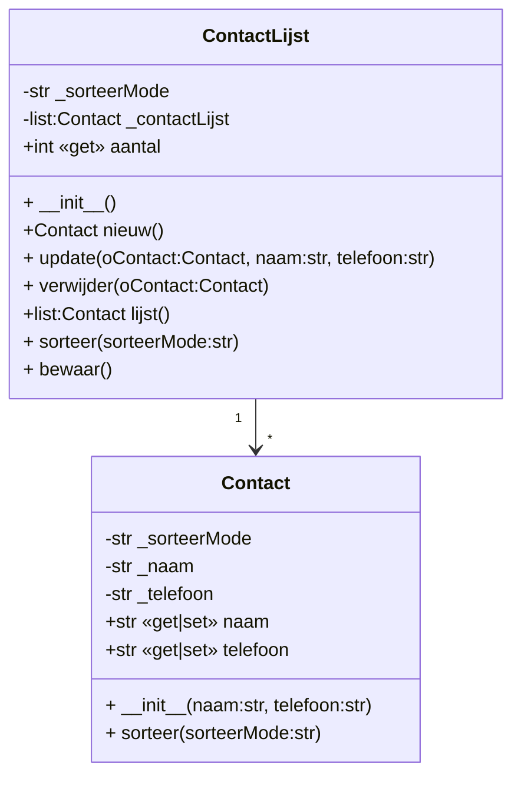

```mermaid
classDiagram
    class Contact {
        -str _sorteerMode
        -str _naam
        -str _telefoon
        +str «get|set» naam
        +str «get|set» telefoon
        + \_\_init\_\_(naam:str, telefoon:str)
        + sorteer(sorteerMode:str)
    }

    class ContactLijst {
        -str _sorteerMode
        -list:Contact _contactLijst
        +int «get» aantal
        + \_\_init\_\_()
        +Contact nieuw()
        + update(oContact:Contact, naam:str, telefoon:str)
        + verwijder(oContact:Contact)
        +list:Contact lijst()
        + sorteer(sorteerMode:str)
        + bewaar()
    }

    ContactLijst "1" --> "*" Contact
```